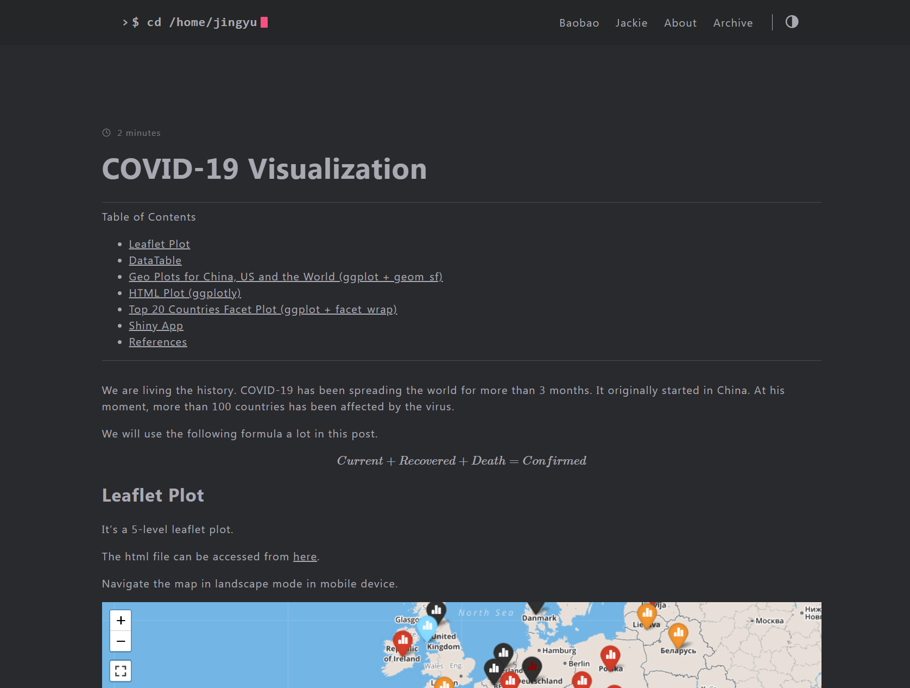

Code and post are saved in [Github](https://github.com/zhongjzsb/COVID-19) and my [Blog](https://zhongjzsb.com/posts/baobao-posts/covid-19-visualization/). 

The map is scheduled to update daily. It can be accessed directly from the [html](https://zhongjzsb.com/images/leaflet-plot.html) file. 
Click the following picture to redirect to the map.

