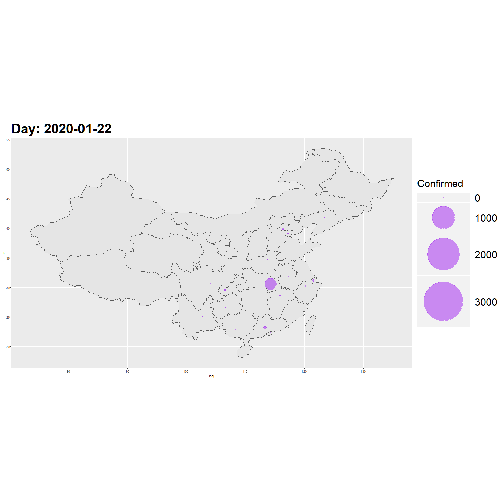
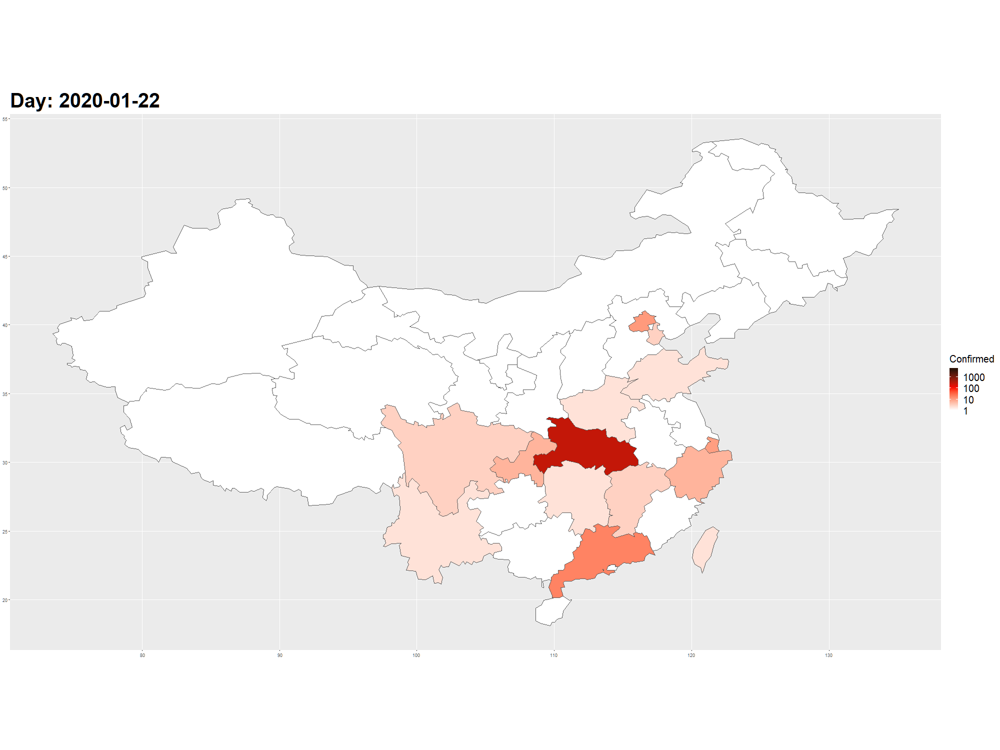

# 2019-nCoV

Visualizing and modeling the 2019-nCoV is the main objective here. The data are coming from [JHU nCov](https://systems.jhu.edu/research/public-health/ncov/). 

As I don't know anything about javascript, so I'm trying to use R to implement this idea. So the initial idea was to create an animated map with dots. 

Then I come into this [github](https://github.com/globalcitizen/2019-wuhan-coronavirus-data/) and created similar plot within R.

## Todo:

1. Modelling the data with SIR?
2. Create leaflet map plot with time-series?
3. Plotly?

## References: 
- [JHU nCov](https://systems.jhu.edu/research/public-health/ncov/)
- [2019-wuhan-ncov](https://github.com/globalcitizen/2019-wuhan-coronavirus-data/)
- [some blog](http://boazsobrado.com/blog/2019/01/13/where-i-was-in-2018/)
- [changing-ggplot-geom-sf-choropleth-fill-color](https://stackoverflow.com/questions/48288183/changing-ggplot-geom-sf-choropleth-fill-colors)
- [ggplot2-sf](https://www.r-spatial.org/r/2018/10/25/ggplot2-sf.html)
- [cn-cities](https://simplemaps.com/data/cn-cities)